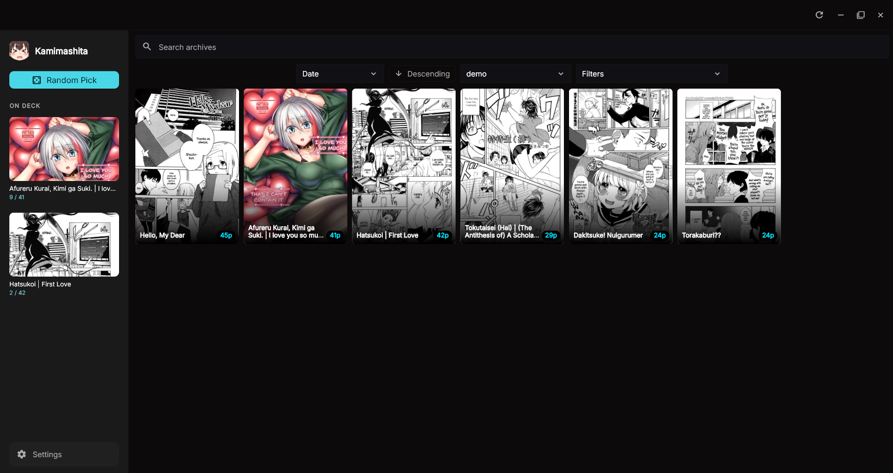
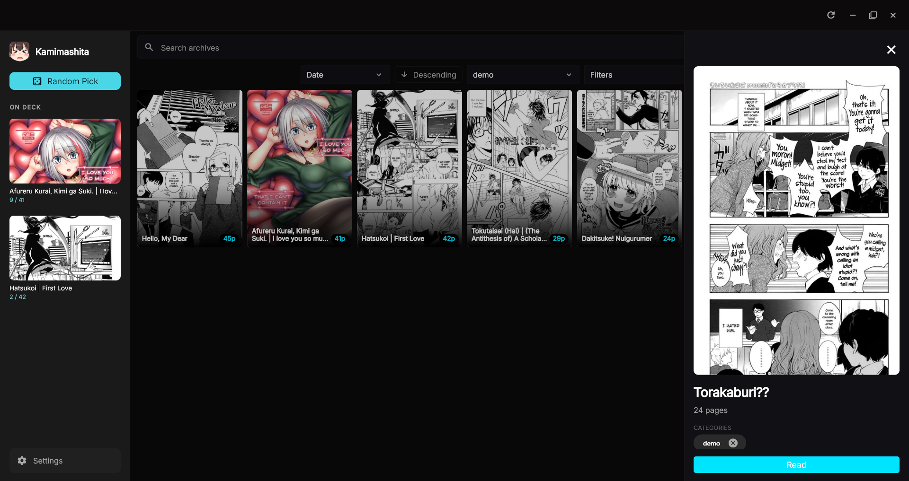
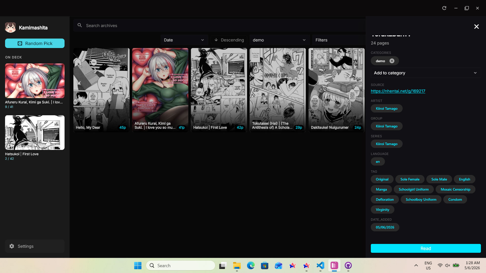
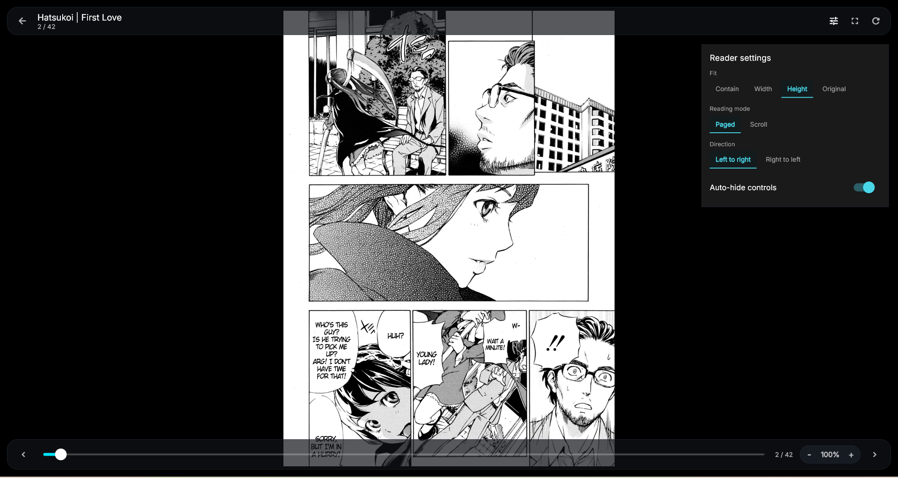
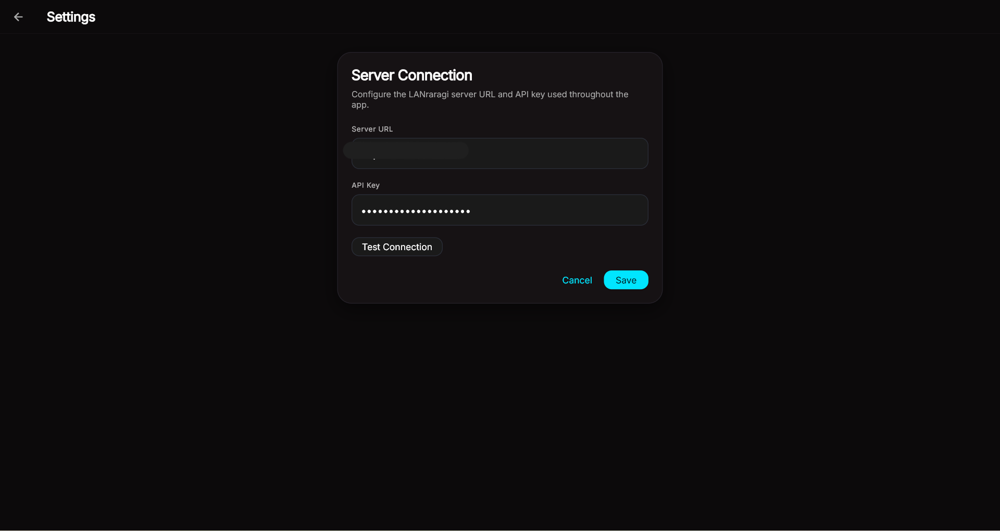

# Kamimashita

Minimal Flutter client for LANraragi.

## Features

- Server URL + API key configuration
- Library browse and search
- Archive details and reader
- Server-backed progress when available
- On Deck and Random Pick

## Downloads

Grab the latest release from the [Releases](../../releases) page.

**Windows** — run the `.exe` installer, or extract the portable `.zip` if you'd prefer no installation.

**macOS** — open the `.dmg`, drag to Applications. Right-click → Open on first launch if Gatekeeper complains.

## Screenshots

### Library



### Archive Details





### Reader



### Settings



## Run

```bash
flutter pub get
flutter run -d windows
```

## Build

```bash
flutter build windows --release
```

## Configure

1. Launch the app.
2. Open Settings.
3. Enter the LANraragi server URL and API key.
4. Save.

## Development

```bash
flutter analyze
flutter test
```
